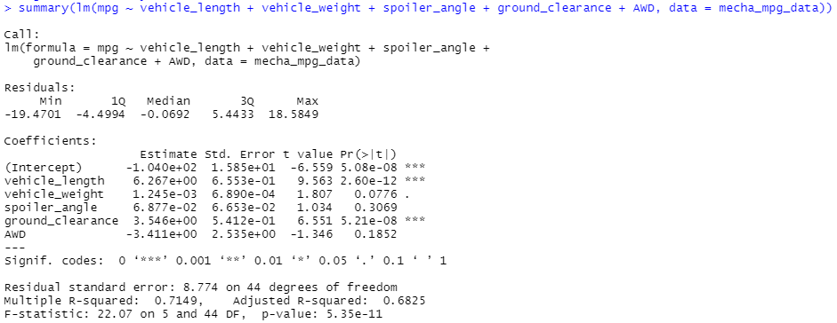
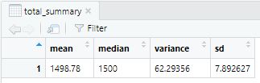
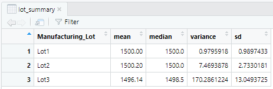
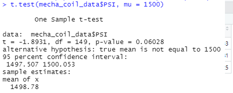
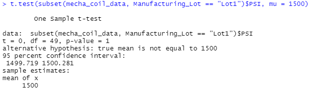
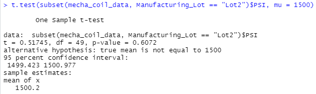
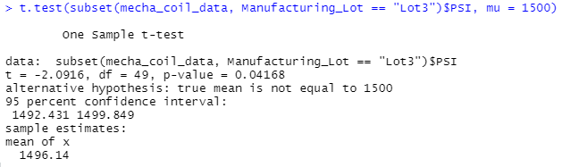

# MechaCar Statistical Analysis
In this module, we were introduced to the R programming language. We learned techniques and specific R functions to analyze our R data sets and to help us make conclusions.

## Challenge
For our challenge, we worked with two data sets provided as part of working for a hypothetical car manufacturer. The code for the deliverables can be found in the following R script: [MechaCarChallenge.R](MechaCarChallenge.R)

## Linear Regression to Predict MPG

Vehicle length (p-value 2.60e-12) and ground clearance (p-value 5.21e-08) look to provide a non-random amount of variance to MPG in the dataset. The other variables (vehicle weight, spoiler angel, and all-wheel drive) look to have a more random variance. The p-value for the model is 5.35e-11 and suggests that the slope for our model is not zero. With our R-squared value being 0.7149, one can conclude that the five variables that we have available to us can predict MPG accurately. Being above 70% in the automotive sector for predicting MPG is probably acceptable, but it would be advantageous to collect additional sample values to improve the model.

## Summary Statistics on Suspension Coils

When analyzing all the lots as one data set, we can conclude that the manufacturing process meets the design specifications of not exceeding 100psi in variance. The variance of the summary statistics was 62.29356. The manufacturing process does not meet the specifications when analyzing the data by lot. Lot 1 and Lot 2 meet specifications but Lot 3 does not. Lot's 3 variance is 170.2861224 and is well above the allowed 100psi.

## T-Tests on Suspension Coils

### Test All Lots

When looking at all the lots combined, the mean is 1498.78 and the p-value is 0.06028. It is higher than 0.05 and we cannot reject the null hypothesis.

### Test Lots 1

When looking at only lot 1, the mean is 1500 and the p-value is 1. It is higher than 0.05 and we cannot reject the null hypothesis.

### Test Lots 2

When looking at only lot 2, the mean is 1500.2 and the p-value is 0.6072. It is higher than 0.05 and we cannot reject the null hypothesis.

### Test Lots 3

Things are different for lot 3. Its mean is 1496.14 and the p-value is 0.04168. It is lower than 0.05 and we can as a result reject the null hypothesis.

## Study Design: MechaCar vs Competition
There are many ways to measure car quality, performance, and customer satisfaction. With today's advanced technologies and complexities of car designs, it seems that many cars suffer from recalls. Our study will focus on the number of recalls of MechaCars vs others.

### Metrics to test
The number of recalls in the first 10 years of ownership.
### Null and alternative hypothesis
#### Null
MechaCars average about the same number of recalls in the first 10 years of ownership vs competition.
#### Alternative
MechaCars average statistically fewer recalls in the first 10 years of ownership vs competition.
#### Statistical test to run
We would run a two sample t-test to compare the number of recalls for MechaCars vs competition. We want to run this test, because we have two groups of samples with numeric value associated to each sample.
### What data is needed to run the statistical test?
We would need to collect two sets of data (MechaCar recalls and competition recalls) for the past 10 years.

